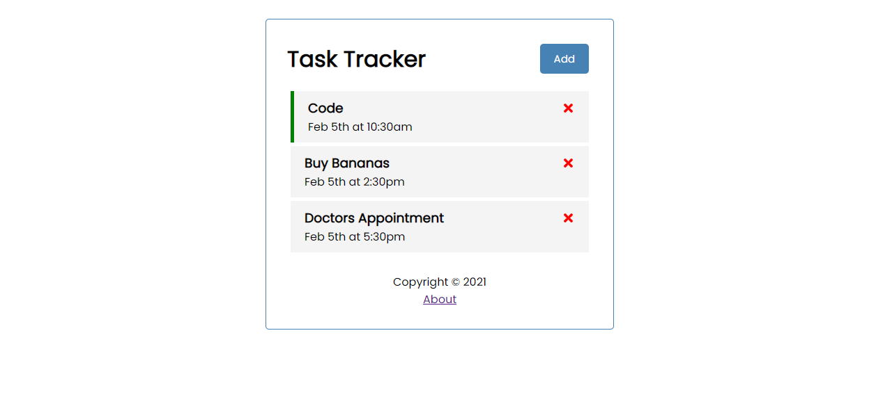

# React-Task-Tracker

> First React project. Following Traversy Media Tutorial.

## Screenshot:



The whole tutorial [YouTube Video](https://youtu.be/w7ejDZ8SWv8)
## Built With

- JavaScript (ES6)
- React.JS
- Node.js
- json-server
- React-Router-DOM

## Getting Started

### Prerequisites

- Node.js
- Any Browser

To get started open the directory where you will save this repo by typing on your terminal:

```
$ cd <directory>
```

- Clone the repo typing:

```
$ git clone git@github.com:Bismarck-GM/task-tracker-app.git
```

- Install dependencies:

After cloning move into the recently created folder (task-tracker-app) and run

```
$ npm install
```

### Usage

Start the JSON-Server:

```
$ npm run server
```

Start the React server:

```
$ npm start
```

A new browser tab/window will open up after the server is initiated.

## Author

👤 **Gerónimo Morisot**

- Github: [@Bismarck-GM](https://github.com/Bismarck-GM)
- Twitter: [@Rewritablee](https://twitter.com/Rewritablee)
- LinkedIn: [Geronimo Morisot](https://linkedin.com/in/geronimomorisot)

## 🤝 Contributing

Contributions, issues and feature requests are welcome!

## Show your support

Give a ⭐️ if you like this project!
Feel free to check the [issues page](issues/).

## Acknowledgments

- Thanks Traversy Media for this useful tutorial [Traversy Media](https://www.traversymedia.com/).

## 📝 License

This project is [MIT](lic.url) licensed.